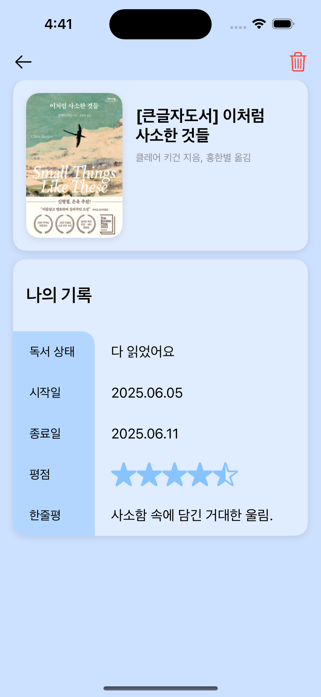
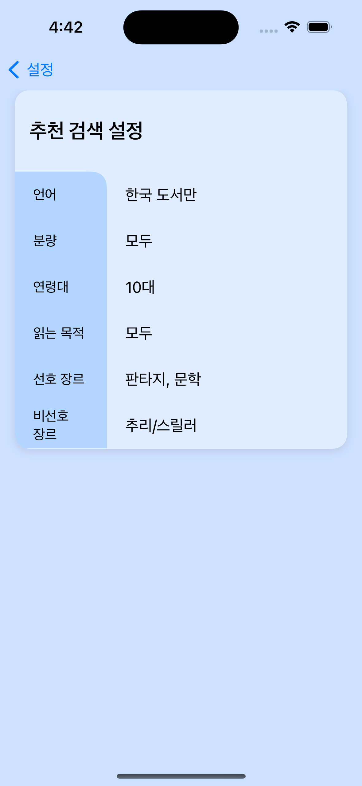
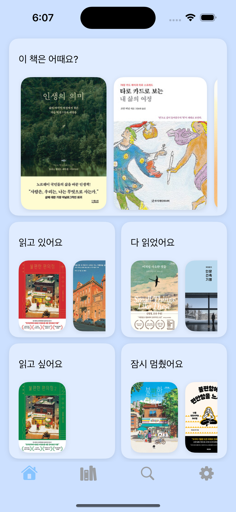
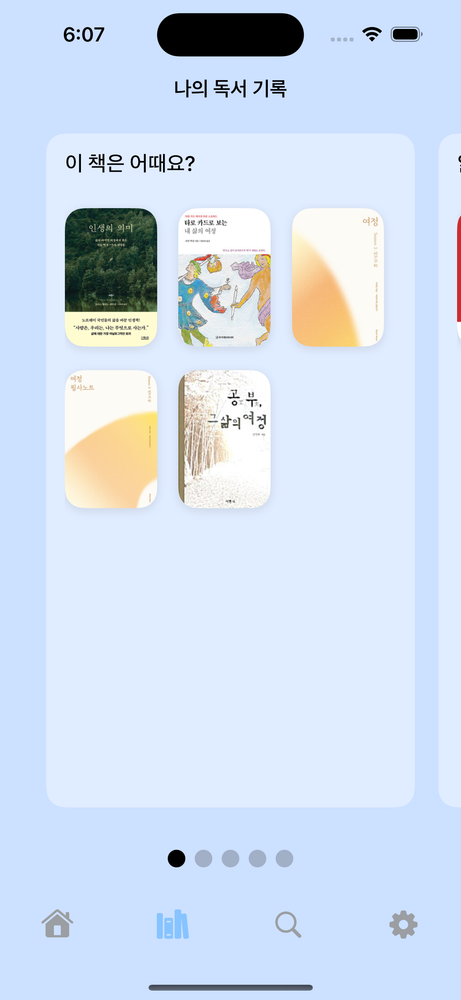
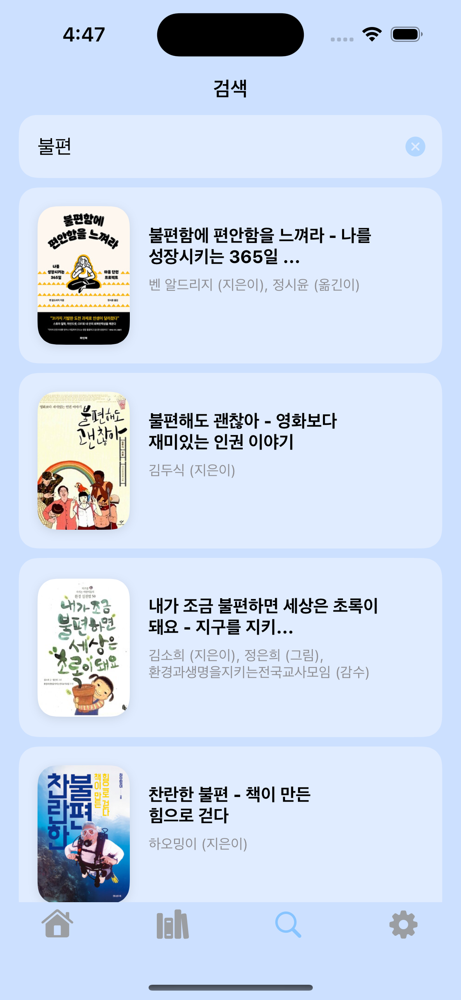

  


# 📚 BookWithMe  
**v1.0.0** (2025-06-19)

## 📑 목차
1. [프로젝트 개요](#1-프로젝트-개요)  
2. [주요 기능](#2-주요-기능)  
3. [API Key 설정](#3-api-key-설정)  
4. [기술 스택 및 아키텍처](#4-기술-스택-및-아키텍처)  
5. [설치 및 실행 방법](#5-설치-및-실행-방법)  
6. [시연 영상 / 스크린샷](#6-시연-영상--스크린샷)

---

## 1. 프로젝트 개요
“사용자의 독서 이력을 관리하고, AI 기반으로 책을 추천해 주는 iOS 앱”  
- **배경**: 독서 기록과 추천 시스템의 부재  
- **타깃 사용자**: 꾸준한 독서 관리를 원하는 모든 독서가

---

## 2. 주요 기능

### 📖 독서 상태 관리
- 상태 구분: 추천 · 읽는 중 · 완료 · 중단 · 위시리스트  
- 기간 기록: 시작일 · 종료일 자동/수동 설정 · 진행률 표시  
- 사용자 평가: 평점(1~5) · 한줄평  
- 목표 기능: 목표 권수·시간 설정 · 달성률 알림  


### ⚙️ 사용자 맞춤 설정
- `BookPrefs` 모델 기반 설정  
- 언어(`language`), 분량(`pageLength`), 연령대(`ageGroup`), 읽기 목적(`readingPurpose`), 선호 장르(`likedGenres`), 비선호 장르(`dislikedGenres`)  


### 🤖 AI 추천 시스템 (OpenAI 연동)



### 🔍 Aladin API 연동 검색
- 검색 방식: 제목·저자·키워드 기반 · 페이징·무한 스크롤 지원  
- 이미지 로딩 최적화: 캐시 처리 · 비동기 이미지 불러오기  
- 상세 정보: 목차 · 책 소개 · 출판사 정보 제공  


---

## 3. API Key 설정
프로젝트 내 적절한 파일(e.g. `APIKey.swift`)에 아래 코드를 추가하고, `"your_aladin_key"`, `"your_openai_key"` 부분을 본인의 실제 API Key로 교체하세요.

```swift
enum APIKey {
    static let aladin_Key = "your_aladin_key"   // Aladin 개발자 센터에서 발급받은 키
    static let openai_Key = "your_openai_key"   // OpenAI 콘솔에서 발급받은 키
}
```

---

## 4. 기술 스택 및 아키텍처
- **언어/프레임워크**: Swift 5.9 · SwiftUI · @Observable  
- **데이터 저장**: Core Data  
- **AI**: OpenAI GPT-4o (`OpenAIRecommender`)  
- **네트워킹**: async/await · URLSession  
- **아키텍처**: MVVM  
- **라이브러리**:  
  - BottomSheet  
  - HorizonCalendar  
  - Kingfisher  

---

## 5. 설치 및 실행 방법

```bash
# 1) 레포지터리 복제
git clone https://github.com/yourname/BookWithMe.git
cd BookWithMe

# 2) 의존성 설치 (Swift Package Manager)
swift package resolve

# 3) Xcode 15 이상에서 프로젝트 열기 및 빌드·실행
open BookWithMe.xcodeproj
```

---

## 6. 시연 영상 / 스크린샷
📽️ [👉 데모 영상 보기 (YouTube Shorts)](https://youtube.com/shorts/dSmYxugmNL8)
